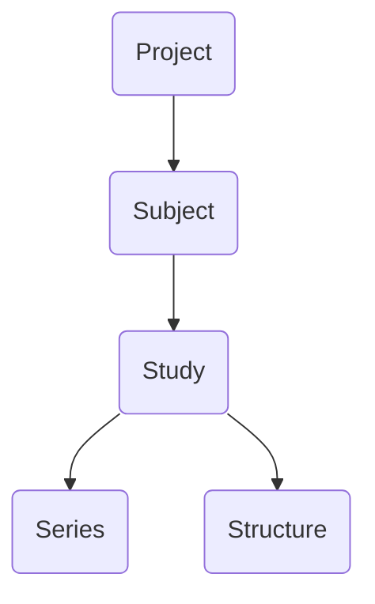

# Viewer

This chapter provides an overview of the main user interface for BrICS. We'll go over how to open a study, view different images within the study, and what the different buttons in the UI represent.

## Lexicon

Within BrICS, we try to use lexicon from the DICOM standard for medical imaging to describe patients, studies, and series. Below is a quick flowchart of the object hierarchy in BrICS.

### Project
A project is the top-level object in the hierarchy, and represents a group of subjects who are to be analyzed together. It can be all the subjects within a clinical study, for example, or all the subjects for a particular analysis that you are trying to do. The Project level is also where authentication occurs for users; users are assigned to specific Projects, and if they don't have access to a Project, they  cannot access any of the data within that project.

A Project also consists of several settings (see the chapter on Administration), which are applied to all objects within the Project.
> Internally, a project ID is attached to every object stored in the database. This allows the software to quickly determine which Project settings to use.

### Subject

A Subject represents a subject (whether a volunteer, patient, a phantom, or an artificial data set). Every Subject in a Project must have a unique **subject_id**, which is an alpha-numeric string; it should not contain any PHI.

### Study
The main working unit of BrICS is the Study. A Study represents a set of images acquired (or generated) for a Subject that are meant to be considered concurrently for visualization or analysis.

In the standard DICOM lexicon, a study corresponds to a specific imaging session. For clinical MRI, a study often consists of multiple sequences (known as series) that are performed while the subject is in the scanner. A study in DICOM is always performed in one session. As such, it only contains one imaging modality (e.g. MRI or CT, but not both).

In BrICS, we expand the definition of Study to allow for series that are taken during different imaging sessions This can mean the same imaging modality from different dates/times, or different modalities. We do this because often we want to compare spectroscopic MRI data alongside other imaging modalities. Sometimes, these other modalities may be acquired at a different time or date. While technically a Study could include series from any date, it is generally good practice to group series in a Study if they should be considered together. An example: a patient undergoes the sMRI scan on January 1st, but no contrast-enhanced imaging was done at that time; the contrast-enhanced scan was performed on January 4th, but should be considered part of the same analysis. However, if the contrast-enhanced scan was done on February 1st, then it really should be part of a different Study.

#### UID

Similar to DICOM, every Study is identified by a [universally unique identifier](https://en.wikipedia.org/wiki/Universally_unique_identifier), a long period-separated numeric string.

#### Reference Series
Every Study contains one series which is considered to be the reference series. This is typically a high-resolution structure MRI, e.g. T1w MRI. All other series in this Study will be registered and aligned to this study. This allows voxel-to-voxel comparison of series within the same study, and allows Structures to be generated / visualized for all series in the study.

### Series

A Series is a 3D image, either acquired directly from the scanner or generated from post-processing. This corresponds to the DICOM series object. A Series can be of many different underlying formats - such as DICOM, MIDAS, ITK, or a binary blob - and BrICS creates a wrapper to allow algorithms and analyses to be run on it.

#### UID
Every series has its own UID for identification.

### Structure

A Structure, also known as a contour, represents a segmentation on top of an image. It can be used for annotating different parts of the image, for identifying a target volume, or for indicating a region-of-interest.

As can be seen in the flow diagram above, a Structure is tied to a Study, not to any specific Series within the Study. In fact, it will be tied to the Study's reference series. Because all Series within a Study are co-registered and aligned in the same image space, a Structure can be freely moved between them in BrICS.

#### UID
Every Structure has a UID for identification.

## Selecting a Project
Once you're logged in to BrICS, the project selection window will pop up. A list of all Projects which you have access to will be shown. Click on any to load the available Subjects for that Project.

## Loading a Study
Once a Project is loaded, there are two different ways to load a study. The first is the basic view; this is the default screen that is shown. It consists of a list of Subjects available in this Project. Clicking on a Subject will be bring up all the Studies contained within that Subject. The Studies are referred to by their date.

Click on any of the Studies to load it.

### Advanced View
To view more details for the Subjects and Studies available, click on the **Advanced Mode** button at the bottom of the Subject list. This will take you to a new page. There is a list of Subjects on the left-hand side of the page. Clicking a Subject will bring up some additional details about the Subject, along with cards representing each Study. Of note, in the advanced view, a list of all Series present within each Study can be seen. The Series that is the Study's reference is indicated by a star.

This view is primarily used for importing and editing data, so we'll cover this in a different chapter. However, one can click the blue **Load Study** button to load the desired Study.

## Main Viewer
Once a Study has been selected, the application will load all Series and display them in the main viewer. The loading process may take several seconds, depending on how many Series need to be loaded. During the loading process, all Series are read from disk, aligned to the Study reference, and converted to a web-friendly format.

In the main view, four images can be seen. The large image on the left is the **Primary Frame**, while additional Frames can be seen in the quadrangle on the right.

At the bottom of each Frame is the name of the Series currently being shown. Clicking on this name will reveal a dropdown menu to allow you to select other Series to display. Depending on the Project's settings, certain Series will be displayed by default.

## Toolbar
The Toolbar is the vertical list of buttons on the right-hand side of the viewer. We will go through each of the buttons' actions in this section.

#### Switching Orientation
The top button is the "Switch Orientation" button. It has a label indicating the current orientation - **Ax**, **Sag**, or **Cor**, representing Axial, Sagittal, or Coronal views, respectively. Hovering over this button expands out a menu, allowing you to switch between orientations.

> **Pro tip**: orientations can also be toggled by pressing the **X** key on your keyboard.
> 
#### Two Image View
The second button on the toolbar has a stylized "2". This is used to toggle between the main multi-paneled view and a view with two large images side-by-side. This view is particularly useful for doing voxel-by-voxel comparisons of either the images or their underling spectra.

#### Spectrum Viewer
#### Algorithms
#### Contouring
#### Voxel-by-Voxel Comparison
#### Metadata
<!--stackedit_data:
eyJoaXN0b3J5IjpbODA2NzM5NzM2LDI0MzkyNzkzOSwtMzQ4MT
g0NzEsLTEzNjU3MjM0MDAsLTk5ODY0OTg1MywxNzQ1MDgyODk3
LC01MjU3ODc5OTUsNTU2Njk0NDQ0XX0=
-->