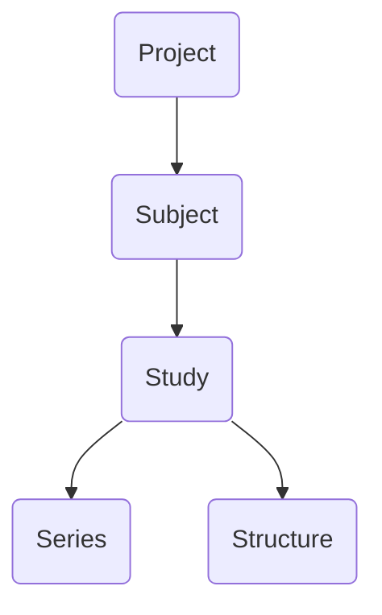

# Viewer

This chapter provides an overview of the main user interface for BrICS. We'll go over how to open a study, view different images within the study, and what the different buttons in the UI represent.

## Lexicon

Within BrICS, we try to use lexicon from the DICOM standard for medical imaging to describe patients, studies, and series. Below is a quick flowchart of the object hierarchy in BrICS.

### Project
A project is the top-level object in the hierarchy, and represents a group of subjects who are to be analyzed together. It can be all the subjects within a clinical study, for example, or all the subjects for a particular analysis that you are trying to do. The Project level is also where authentication occurs for users; users are assigned to specific Projects, and if they don't have access to a Project, they  cannot access any of the data within that project.

Internally, a project ID is attached to ever
<!--stackedit_data:
eyJoaXN0b3J5IjpbLTEzNjU1Nzg5MjBdfQ==
-->