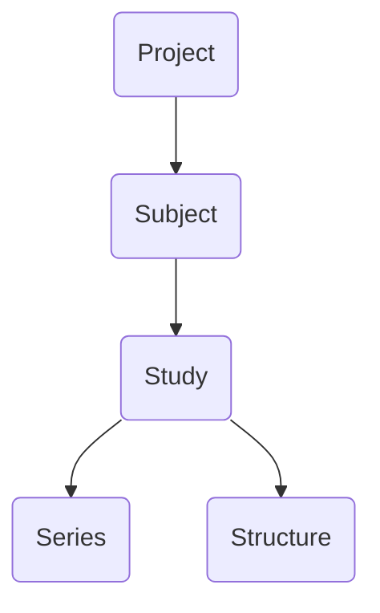

# Viewer

This chapter provides an overview of the main user interface for BrICS. We'll go over how to open a study, view different images within the study, and what the different buttons in the UI represent.

## Lexicon

Within BrICS, we try to use lexicon from the DICOM standard for medical imaging to describe patients, studies, and series. Below is a quick flowchart of the object hierarchy in BrICS.

### Project
A project is the top-level object in the hierarchy, and represents a group of subjects who are to be analyzed together. It can be all the subjects within a clinical study, for example, or all the subjects for a particular analysis that you are trying to do. The Project level is also where authentication occurs for users; users are assigned to specific Projects, and if they don't have access to a Project, they  cannot access any of the data within that project.

A Project also consists of several settings (see the chapter on Administration), which are applied to all objects within the Project.
> Internally, a project ID is attached to every object stored in the database. This allows the software to quickly determine which Project settings to use.

### Subject

A Subject represents a subject (whether a volunteer, patient, a phantom, or an artificial data set). Every Subject in a Project must have a unique **subject_id**, which is an alpha-numeric string; it should not contain any PHI.

### Study
The main working unit of BrICS is the Study. A Study represents a set of images acquired (or generated) for a Subject that are meant to be considered concurrently for visualization or analysis.

In the standard DICOM lexicon, a study corresponds to a specific imaging session. For clinical MRI, a study often consists of multiple sequences (known as series) that are performed while the subject is in the scanner. A study in DICOM is always performed in one session. As such, it only contains one imaging modality (e.g. MRI or CT, but not both).

In BrICS, we expand the definition of Study to allow for images that are taken during different imaging sessions This can mean the same imaging modality from different dates/times, or different modalities. We do this because often we want to compare spectroscopic MRI data alongside other imaging modalities 
<!--stackedit_data:
eyJoaXN0b3J5IjpbLTUyNTc4Nzk5NSw1NTY2OTQ0NDRdfQ==
-->