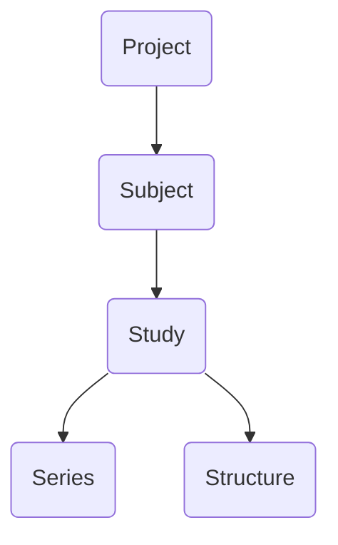

# Viewer

This chapter provides an overview of the main user interface for BrICS. We'll go over how to open a study, view different images within the study, and what the different buttons in the UI represent.

## Lexicon

Within BrICS, we try to use lexicon from the DICOM standard for medical imaging to describe patients, studies, and series. Below is a quick flowchart of the object hierarchy in BrICS.

<!--stackedit_data:
eyJoaXN0b3J5IjpbMjExMjE4Mzc1NF19
-->